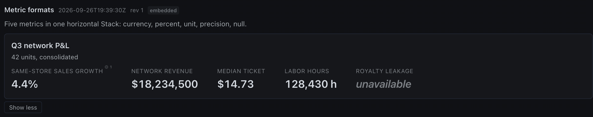
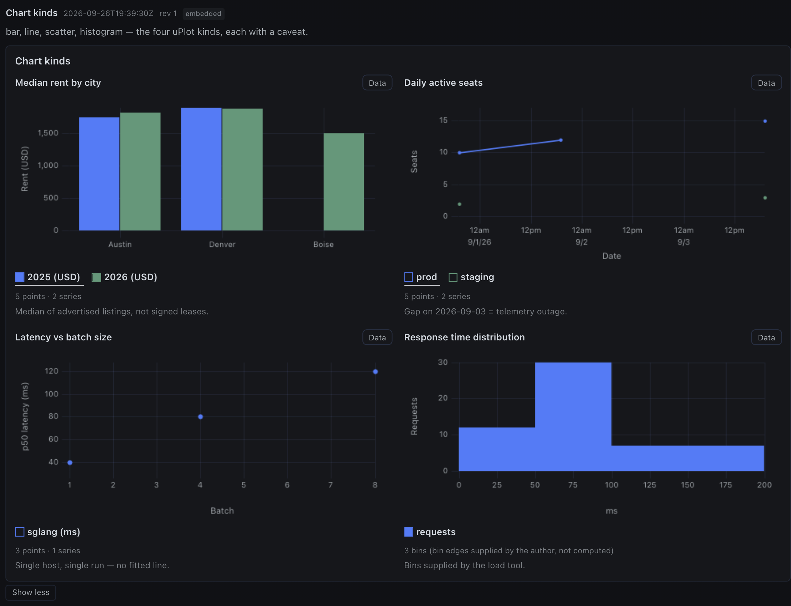
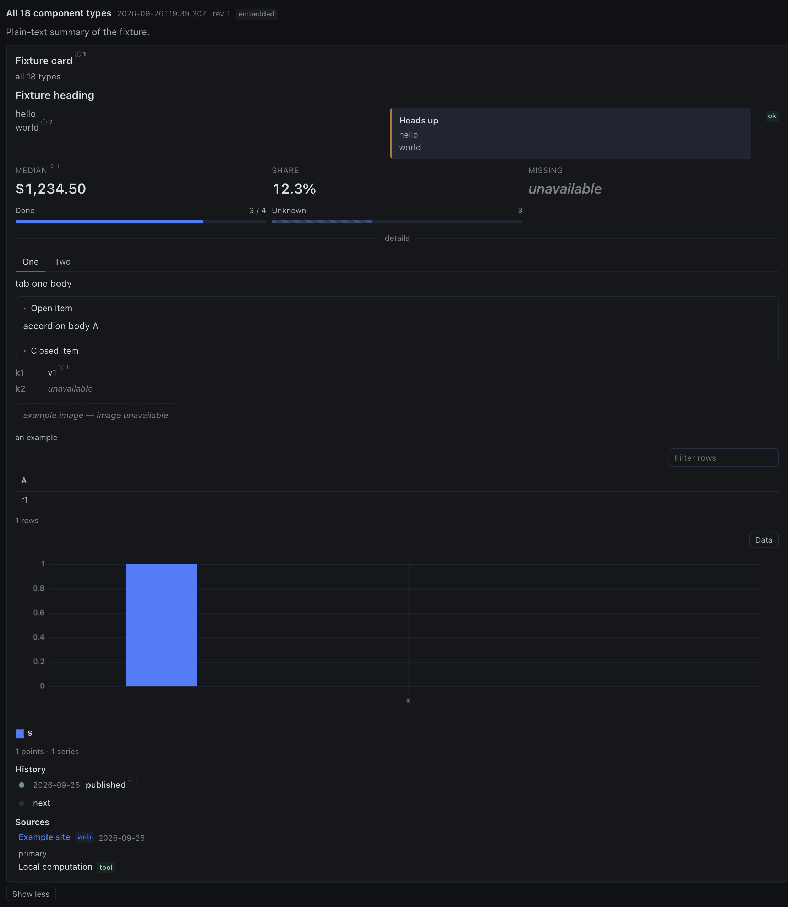

# hermes-rich-ui

**Publish rich, read-only answer cards from Hermes agents.** One `rich_present`
tool call turns an agent's real, gathered data — table rows, chart series,
metrics, a dated sequence, cited sources — into an A2UI v1.0 `createSurface`
record against the read-only `hermes-rich-ui/1` catalog (26 component types).
The agent's reply carries a `::richui{id="<card_id>"}` directive that the Hermes
desktop transcript expands into an inline card, rendered by the zod-stubbed
`Renderer` from `@json-render/react` 0.21.0 with uPlot 1.6.32 charts. Nothing
renders until a stdlib-only admission engine has validated the record against
the frozen `docs/CONTRACTS.md` budgets — a rejected card is rejected before a
byte is written to the card store.

<p>



</p>

All three images are pixel-real captures of the renderer (no mockups): a
metrics card showing every value format — including `null` rendering as
*unavailable*, never as 0 — a four-kind chart card, and an all-components
fixture card (timeline, tabs, accordion, table, chart, sources).

## The two halves

| Half | Runs on | Installs to |
|---|---|---|
| Gateway (tools, admission, card store, REST) | the machine running `hermes serve` | `~/.hermes/plugins/hermes-rich-ui/` |
| Desktop (transcript renderer) | the APP machine | `~/.hermes/desktop-plugins/hermes-rich-ui/plugin.js` |

**No patched core required.** This is a pure Hermes plugin: the gateway half
registers its tools through the public plugin API, and the desktop half is one
bundled ESM file loaded through the public desktop-plugin mechanism. Nothing
here forks, patches, or reaches into Hermes internals.

## Quickstart

Both halves must be installed for cards to render; each is harmless alone
(`INSTALL.md` has the negative-control walkthrough for one-half-installed
cases).

Half 1 — gateway (on the `hermes serve` machine):

```
cp -r dashboard/ engine/ catalog/ skill/ ~/.hermes/plugins/hermes-rich-ui/
```

Enable it in `~/.hermes/config.yaml`, then restart:

```yaml
plugins:
  enabled:
    - hermes-rich-ui
```

```
hermes serve
```

The serve log must print
`Mounted plugin API routes: /api/plugins/hermes-rich-ui/`, and
`curl -s http://<gateway>/api/plugins/hermes-rich-ui/health` must return
`{ok:true, ...}`.

Half 2 — desktop (on the machine running the Hermes desktop app):

```
mkdir -p ~/.hermes/desktop-plugins/hermes-rich-ui
cp desktop/plugin.js ~/.hermes/desktop-plugins/hermes-rich-ui/plugin.js
sha256sum -c desktop/plugin.js.sha256    # Linux  (macOS: shasum -a 256 -c)
```

Then open Settings → Plugins (Capabilities) in the app, flip **hermes-rich-ui**
on, and reload. From then on, agents can call `rich_present` and paste the
returned directive line into their reply.

## Philosophy: read-only, evidence-first

- 26 read-only component types. No forms, no actions, no scripts, no network
  calls from the card. Local interaction (sort/filter/page, chart hover, tabs,
  expand) is built into the renderer, never authored in the spec.
- The agent authors only content; the gateway mints identities, admits the
  record against `docs/CONTRACTS.md` budgets (rejects, never truncates), stores
  it under `$HERMES_HOME/rich-ui/cards/`, and returns the directive.
- Every bound value is a data binding (`{"path": "/data/..."}` /
  `{"path": "/meta/..."}`). Unknown values are `null` and render as
  "unavailable", never as 0.
- External claims carry `sources` and per-element `sourceIds`; computed values
  carry `derivations` with method and input paths. Fabricating series, prices,
  or history to fill a card is forbidden by the authoring contract
  (`skill/SKILL.md`).
- Chart engine is one library: uPlot 1.6.32 (bar / line / histogram / scatter /
  area / waterfall / range, plus the Sparkline / BarList / HeatMap micro-viz).

## Security posture

- **Read-only catalog.** No actions, no data-model writeback, no event
  handlers, no catalogId overrides. Cards cannot ask for refresh or push data
  anywhere; interactive refresh belongs to trusted chrome, never to spec fields.
- **SDK-only renderer.** The desktop bundle imports only `react`,
  `react/jsx-runtime`, and `@hermes/plugin-sdk`. Every attempt to bypass the
  sandbox is caught at build time by a banned-surface scan that rejects
  `window.hermesDesktop`, `localStorage`, `document.querySelector`,
  `innerHTML`, `eval`, `new Function`, dynamic `import()`, and bare
  `document`/`window` (one content-allowlisted uPlot environment guard is the
  sole exception) — any hit fails the build.
- **Admission before persistence.** The stdlib-only Python engine (no
  third-party imports anywhere in the gateway half) validates structure,
  budgets, binding paths, and URL schemes (`https://` only) and rejects the
  whole card on any violation; nothing is written to the card store until
  admission passes.
- **No self-updater.** Nothing downloads or swaps code at runtime. The
  committed bundle is the artifact, and CI rebuilds it and fails on any diff.

## The 26 types (catalog `hermes-rich-ui/1`)

| # | component | purpose |
|---|---|---|
| 1 | Card | the card itself: title, subtitle, footer, children |
| 2 | Stack | vertical/horizontal arrangement |
| 3 | Grid | 1–4 column layout |
| 4 | Divider | section separation, optional label, horizontal or vertical |
| 5 | Tabs | switch between 1–8 child views |
| 6 | Accordion | 1–12 expandable sections |
| 7 | Heading | level 1–5 heading (5 = eyebrow) |
| 8 | Text | plain explanatory text, tone/variant (incl. mono) |
| 9 | Callout | takeaway, limit, or uncertainty |
| 10 | Badge | compact categorical label |
| 11 | Metric | one salient scalar, optional renderer-computed delta vs `previous` (null ⇒ unavailable) |
| 12 | Progress | completed/total with optional target tick, or indeterminate |
| 13 | KeyValueList | compact label/value facts |
| 14 | Image | https-only image with required alt |
| 15 | DataTable | typed, sortable (seedable `defaultSort`), pageable rows |
| 16 | Chart | bar / line / histogram / scatter / area / waterfall / range (uPlot) |
| 17 | Timeline | dated or labeled sequence (done/active/pending/failed) |
| 18 | SourceList | evidence and provenance |
| 19 | CodeBlock | verbatim code/config block, caption, optional line numbers |
| 20 | Checklist | undated done/unchecked/unknown items with computed tally |
| 21 | ChipSet | up to 24 compact chips in one wrap row |
| 22 | AsOf | observed/published provenance stamps (never-fabricated ISO-8601) |
| 23 | ImageGallery | up to 8 https-only evidence tiles in 1–4 columns |
| 24 | Sparkline | inline KPI trend strip beside a Metric (trend chip computed) |
| 25 | BarList | ranked list with inline bars (nulls sink last, never 0) |
| 26 | HeatMap | rows × cols matrix (≤144 cells) with computed color ramp |

Props are frozen in `docs/CONTRACTS.md` §2; authoring guidance lives in
`skill/SKILL.md` with complete recipe examples in
`skill/references/recipes.md`.

## Where to go next

- Authoring agents: start at [`skill/SKILL.md`](skill/SKILL.md), then the ten
  recipes in [`skill/references/recipes.md`](skill/references/recipes.md).
- Installing: [`INSTALL.md`](INSTALL.md) (both halves + negative control).
- Contributing / hacking on the repo: read [`AGENTS.md`](AGENTS.md) (laws,
  build & test), then [`CONTRIBUTING.md`](CONTRIBUTING.md), then
  [`docs/CONTRACTS.md`](docs/CONTRACTS.md) — the contracts are frozen for a
  reason.

Contributions keep the tree publish-clean: `python3 scripts/make_public.py
/tmp/public-tree` (also run by `tests/test_public_strings.py` in CI) audits
every shipped file for machine-specific strings and refuses to export if any
un-allow-listed hit remains.

MIT licensed — see `LICENSE` (Jacob Hausler).
